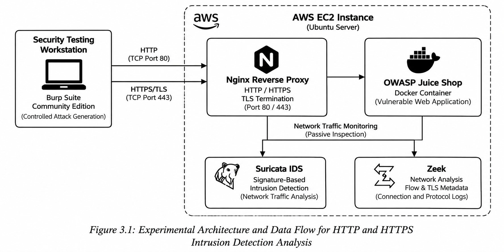

# Security Visibility Tradeoffs in TLS-Encrypted Cloud Network Environments

**Master's Cybersecurity Capstone | California State University, Dominguez Hills | 2026**

Self-directed graduate capstone evaluating how TLS encryption affects the visibility and detection capabilities of network-based intrusion detection systems in a controlled AWS cloud environment.

## Research Question

**How does TLS encryption impact the visibility and detection capabilities of network-based intrusion detection systems in cloud environments?**

## Hypothesis

Network-based intrusion detection systems would experience a measurable reduction in detection effectiveness for application-layer attacks when payload inspection is removed by TLS encryption, while retaining limited visibility through TLS handshake metadata and flow-level features.

## Scope

This project compares full application-layer visibility under HTTP with metadata- and connection-level visibility under HTTPS in a controlled cloud environment. The experiment evaluates how encryption changes the information available to network defenders using Suricata and Zeek.

## Methodology Overview

A controlled cloud-based lab was deployed in Amazon Web Services (AWS) using an EC2 instance running Ubuntu Server. OWASP Juice Shop was deployed in a Docker container as the vulnerable target application, while Nginx was configured as a reverse proxy with a self-signed TLS certificate to support both HTTP and HTTPS testing.

Suricata and Zeek were configured to monitor network activity. Burp Suite Community Edition was used from a local workstation to generate controlled application-layer attacks against the lab environment.

Three attack scenarios were executed under both HTTP and HTTPS conditions:

- SQL injection
- Cross-site scripting (XSS)
- Repeated failed login attempts

This produced **six controlled test cases**.

The environment, attack methodology, and monitoring configuration were kept consistent while the transport condition changed between HTTP and HTTPS, allowing TLS encryption to serve as the primary experimental variable.

## Project Architecture

The experimental environment was designed to compare network visibility under identical HTTP and HTTPS attack scenarios while keeping the target application, attack methodology, and monitoring tools consistent.

## Experimental Design

| Variable | HTTP Condition | HTTPS Condition |
| --- | --- | --- |
| Application | OWASP Juice Shop | OWASP Juice Shop |
| Attack Method | Burp Suite | Burp Suite |
| Attack Scenarios | SQLi, XSS, login abuse | SQLi, XSS, login abuse |
| Monitoring | Suricata + Zeek | Suricata + Zeek |
| Payload Visibility | Available | Encrypted |
| Primary Difference | No TLS | TLS enabled |

**Independent variable:** TLS encryption  
**Primary observations:** IDS alerts, application-layer visibility, TLS metadata, and connection behavior.

## Technology Stack

- **Cloud Platform:** AWS EC2
- **Operating System:** Ubuntu Server
- **Application:** OWASP Juice Shop
- **Containerization:** Docker
- **Reverse Proxy / TLS:** Nginx
- **Intrusion Detection:** Suricata
- **Network Analysis:** Zeek
- **Security Testing:** Burp Suite Community Edition
- **Packet Analysis:** Wireshark
- **Protocols:** HTTP, HTTPS/TLS

> **Ethical Testing Note:** Burp Suite was used solely for controlled security testing against the intentionally vulnerable application hosted within the AWS lab environment. All testing was limited to systems under my control.

## Results

| Capability | HTTP | HTTPS |
| --- | --- | --- |
| Application-layer payload visibility | Full | Not visible to passive network monitoring |
| Zeek HTTP logging | Available through `http.log` | Application requests not visible |
| TLS metadata | Not applicable | Available through TLS/SSL logging |
| Connection behavior | Visible | Visible |
| Suricata application-layer detection | Stronger | Reduced |
| Analyst visibility | Payload + behavior | Metadata + behavior |

## Key Findings

- TLS encryption significantly reduced application-layer visibility available to network-based intrusion detection.
- Suricata's signature-based detection was more effective when payload content was directly observable.
- Zeek continued to provide useful connection-level and TLS metadata after application payloads became encrypted.
- Repeated login activity remained behaviorally observable even when request contents could not be inspected.
- Effective monitoring of encrypted environments requires layered telemetry, including network metadata, authentication logs, application logs, endpoint visibility, and behavioral analysis.
